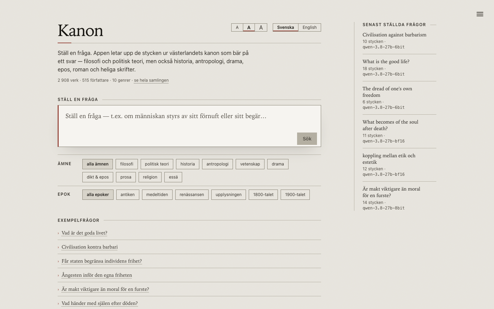
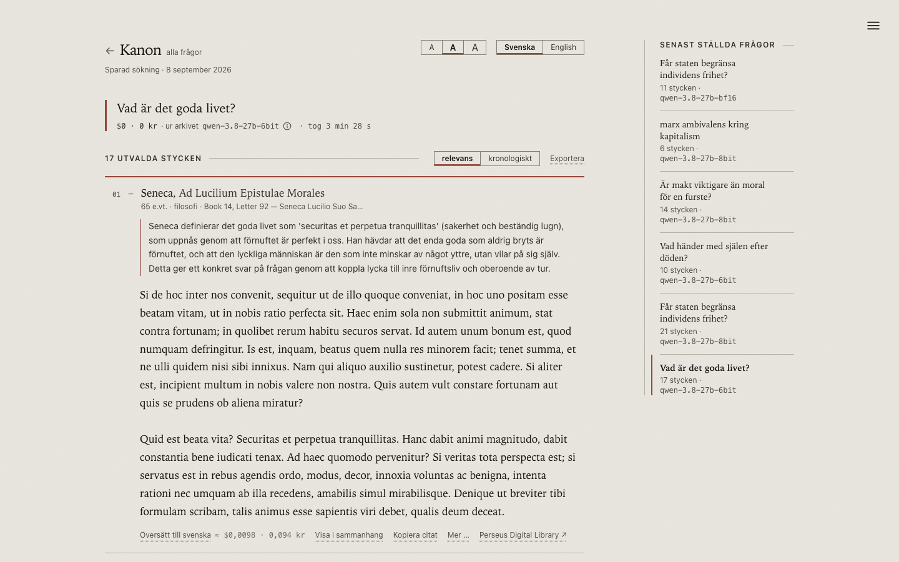
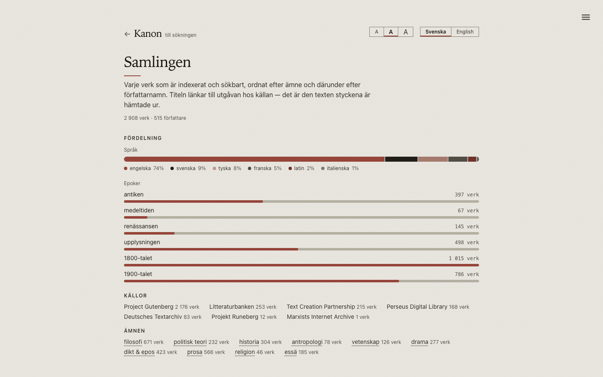
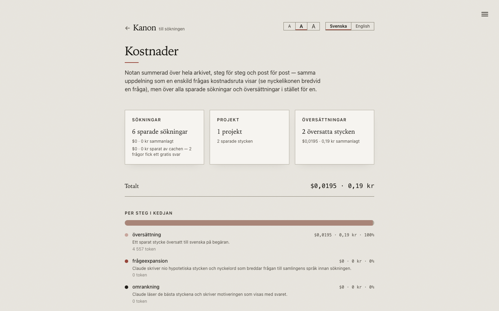
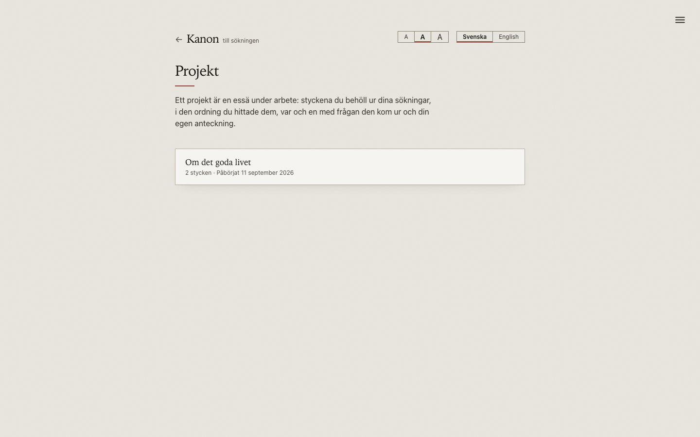
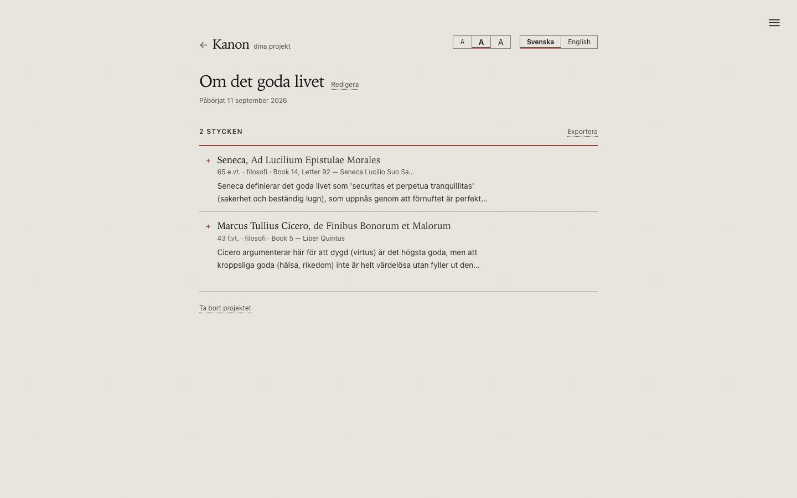
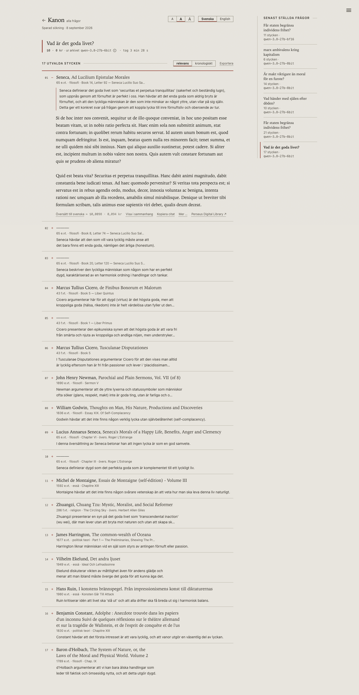

# Canon

Ask a question and get back the passages from the Western canon that actually
carry an answer — author, work, book and chapter, each with a rationale for why
it answers the question. The interface is Swedish and English; the question can
be asked in either.

## Contents

- [Views](#views)
- [Six sources, six languages](#six-sources-six-languages)
- [Getting started](#getting-started)
- [How search works](#how-search-works)
- [Worth knowing](#worth-knowing)

## Views

**Search view** — the question, subject/era filters, example questions. The
model switch (see "Local model" below) lives in the menu in the top-right
corner, on every page, not just this one.


**Search view, with an answer** — the top passage opens on its own; the rest
stay collapsed until clicked.


**The collection** — every work, ordered by genre and then by author, with the
spread across subjects, eras, sources and languages at the top


**Costs** — the bill per step in the chain and per line-item kind


**Projects** — saved essays in progress


**A project** — kept passages in their own order, with a note


**A shared search** — a permalink to a previous answer


The collection is ~2690 works by ~490 authors in **six languages** and ten
genres: English public-domain editions from Project Gutenberg, Swedish original
texts from Litteraturbanken and Projekt Runeberg, antiquity via Perseus Digital
Library — in English translation and in Latin — English print 1473–1700 in its
first edition from the Text Creation Partnership, German idealism in the
original from Deutsches Textarchiv, the French and Italian canon in the
original from Gutenberg's own sections for them, and freely licensed
translations from the Marxists Internet Archive.

```
english 2100 · swedish 271 · french 148 · german 83 · latin 65 · italian 19
```

| genre            | ~works | examples                                                                   |
| ----------------- | ------ | --------------------------------------------------------------------------- |
| philosophy         | 632   | Plato, Aristotle, Spinoza, Kant, Nietzsche, Croce, Russell                 |
| prose              | 505   | Cervantes, Rabelais, Scott, Dostoevsky, Kafka, Woolf, Hamsun, Lagerlöf     |
| poetry & epic       | 383   | Homer, Sappho, Virgil, Dante, Petrarch, Milton, Snorri, Yeats              |
| history            | 297   | Herodotus, Tacitus, Arrian, Villehardouin, Gibbon, Buckle, Geijer          |
| drama              | 248   | Aeschylus, Euripides, Shakespeare, Racine, Ibsen, Strindberg               |
| political theory    | 234   | Machiavelli, Harrington, Winstanley, Federalist, Marx, Douglass, Ellen Key |
| essay              | 167   | Theophrastus, Longinus, Thomas Browne, Johnson, Hazlitt, Repplier, Belloc  |
| science            | 96    | Hippocrates, Euclid, Boyle, Galileo, Newton, Darwin, Freud                 |
| anthropology        | 78    | Morgan, Tylor, Frazer, Boas, Lang, Malinowski, Rivers, Cushing             |
| religion           | 46    | The Bible, the Qur'an, the Upanishads, Origen, Luther, Bunyan             |

The breadth isn't decoration. A question like "civilization versus barbarism" is
answered worst by the treatise that defines the terms and best by Tacitus
describing the Germanic tribes, Ferguson theorizing the transition, Gibbon
explaining the collapse, Euripides dramatizing the breach of hospitality, and
Conrad showing the colonizer's decay. Genre travels through the whole chain, and
reranking is asked to spread the selection across it.

## Six sources, six languages

| source                     | works | what it gives                                                                             |
| --------------------------- | ----- | ------------------------------------------------------------------------------------------- |
| Project Gutenberg           | 1626  | the English-language canon, plus the French (147) and Italian (19)                          |
| Litteraturbanken            | 259   | proofread Swedish editions — Lagerlöf, Söderberg, Boye, Södergran, Ekelund, Ellen Key       |
| Text Creation Partnership   | 142   | English print 1473–1700 in its first edition, hand-transcribed                              |
| Perseus Digital Library     | 168   | antiquity with its own citation intact — 103 in translation, 65 in Latin                    |
| Deutsches Textarchiv        | 70    | Kant, Hegel, Marx, Goethe and Schiller in the original                                      |
| Projekt Runeberg            | 12    | Strindberg in the original, plus Almqvist and Topelius                                      |
| Marxists Internet Archive   | 1     | Gramsci's political writings, in MIA's own CC translations                                  |

None of the last five is free outright, and that's why each one has its own
rights check that runs every time a text is fetched — not just when the
manifest is built. Each source's rights basis, its quirks, and what it adds
that Gutenberg doesn't is a measurement, logged in its own file:

- [Litteraturbanken and Projekt Runeberg](docs/measurements/sources-litteraturbanken-runeberg.md) — which editions are free, and why the free Strindberg is split across two sources
- [Perseus Digital Library](docs/measurements/sources-perseus.md) — the two independent grounds for admitting a text, and what Perseus adds beyond Gutenberg's antiquity
- [Text Creation Partnership](docs/measurements/sources-tcp.md) — the catalog's misleading `Status` column, long s, and how much a `<gap>` actually costs
- [Deutsches Textarchiv](docs/measurements/sources-dta.md) — long s, overwritten vowels, and a line-break bug that swallowed words in Hegel
- [French and Italian, via Gutenberg](docs/measurements/sources-french-italian.md) — no new source needed, just a discarded filter
- [Perseus's Latin](docs/measurements/sources-perseus-latin.md) — duplication, not a gap-filler, and why it's still worth having
- [Marxists Internet Archive](docs/measurements/sources-marxists.md) — the provenance line that separates a free translation from a withdrawn one
- [Scripture numbers itself](docs/measurements/sources-bible.md) — how the Bible went from unlocatable to a citation on every passage
- [Two sources that were tried and didn't work out](docs/measurements/sources-tried-and-rejected.md) — Deutsche Digitale Bibliothek and HathiTrust
- [What can't be brought in](docs/measurements/sources-cant-bring-in.md) — the authors still under copyright, and when that changes

The collection is **six languages**, and that's a retrieval property as much as
a source list: the embedding model splits the vector space by language before
content, measured in [Six languages, and why it
works](docs/measurements/six-languages.md) — the single most consequential
measurement in this repo, and the reason query expansion writes nine passages,
not four.

## Getting started

### Prerequisites

- **Node 22+** and **pnpm** — the repo pins an exact pnpm version via
  `packageManager` in `package.json`; run `corepack enable` and corepack fetches
  the right version automatically the first time you run `pnpm`.
- **An Anthropic API key.** Search calls Claude in two steps (query expansion
  and reranking, see `src/lib/claude.ts`), and they can't be turned off —
  without a key the app starts but every search fails.
- Native modules (`better-sqlite3`, `sqlite-vec`, `onnxruntime-node`) build
  during `pnpm install`. Nothing extra is needed on macOS/Linux; on Windows the
  native npm package build tools are required (Visual Studio Build Tools).
- **Time.** Building the full search index (`pnpm ingest`, below) takes
  **5–8 hours** the first time — plan to leave it running overnight rather
  than wait it out. It's resumable, so stopping and restarting loses nothing.

### Installation

```bash
git clone <repo-url> canon
cd canon
pnpm install
```

### API key

1. Create a key at
   [console.anthropic.com/settings/keys](https://console.anthropic.com/settings/keys)
   (requires an Anthropic account with billing set up — searches cost real
   money, see `Cost` below).
2. Copy the example file and paste in the key:

   ```bash
   cp .env.example .env.local
   ```

   Open `.env.local` and set `ANTHROPIC_API_KEY=sk-ant-...`. The file is
   gitignored (`.env*.local`), so the key is never checked in. The other
   variables in `.env.example` are optional — each has its measured default
   commented in, with the measurement that set it.
3. Restart `pnpm dev` if the server was already running — environment
   variables are read at startup.

### Build the search index and start

```bash
pnpm ingest                    # builds the search index — several hours the first time
pnpm dev
```

`pnpm ingest` downloads the texts, splits them into passages, and computes
embeddings locally. The first run also fetches the embedding model (~120 MB).
The run is resumable — stop it any time and run again; already-indexed works
are skipped. Expect 5–8 hours for the whole collection; ~500 passages per work
need embedding.

```bash
pnpm status                       # how far indexing has gotten, by genre
pnpm build-corpus                 # regenerate the Gutenberg part of the manifest
pnpm build-corpus-sv              # regenerate the Swedish part
pnpm build-corpus-mia             # regenerate the MIA part (checks the licenses)
pnpm build-corpus-perseus         # regenerate the Perseus part (checks the rights)
pnpm build-corpus-perseus --authors  # list the catalog's name forms
pnpm build-corpus-tcp             # regenerate the TCP part (checks CC0 and condition)
pnpm build-corpus-dta             # regenerate the German part
pnpm build-corpus-fr              # regenerate the French part
pnpm build-corpus-it              # regenerate the Italian part
pnpm build-corpus --dry           # show the report without writing the file
pnpm ingest --limit=5             # only the first five works
pnpm ingest --limit=0             # sync metadata only, index nothing
pnpm ingest --only=1497,rodarum   # only certain works, given by the source's ID
pnpm ingest --source=runeberg     # only works from one source
pnpm ingest --force               # reindex everything
pnpm eval                         # retrieval against the gold standard
pnpm eval --compare               # hybrid vs. plain keyword search
pnpm eval --no-rerank             # without the cross-encoder, to see what it moves
pnpm eval --fresh                 # discard the saved plans and re-expand (costs money)
pnpm eval "your own question"     # run a question of your own
pnpm storybook                    # component library, isolated from the app
pnpm build-storybook               # static Storybook build
```

`pnpm status` can run while indexing is in progress — it reads the database,
not the log, so it answers correctly even if the run was stopped and restarted.
It's done when it prints `✓ Done`.

`pnpm storybook` starts the component library on its own — every component
under `src/app/components/ui/` with a story, plus the design guides
(`.storybook/DesignPrinciples.mdx` and its siblings) that explain the
parchment/ink tokens, spacing and motion choices behind them.

`pnpm ingest` skips finished works, so a new field in the manifest would
otherwise never reach them. So title, author, year, era and genre are synced
for everything already in the database on every run — an `update`, not a
reindex. Changing the _chunking_, though, requires reindexing the works:
`pnpm ingest --force`.

## How search works

A Swedish question about "the anxiety of one's own freedom" shares no words
with Jowett's nineteenth-century English. Plain keyword search therefore misses
most of it. The chain looks like this:

0. **The cache** — if the question has been asked before, the app answers
   straight from the archive, without a single call to Claude. Verbatim first,
   then by vector similarity. See [Saved searches: permalink and
   cache](docs/measurements/saved-searches-cache.md).

1. **Query expansion** — Claude rewrites the question into _nine_ hypothetical
   ~90-word passages, plus a list of period-typical keywords, the question
   translated into the collection's languages, and the names of any authors or
   works the question explicitly mentions. This is
   [HyDE](https://arxiv.org/abs/2212.10496): a made-up answer sits much closer
   to the target passages in vector space than the question does.

   Nine, not one: four English registers so a Hobbes-shaped passage doesn't
   crowd out Euripides, and one passage per other language, because the
   embedding model splits the vector space by language before content — a
   branch only finds text in the language its passage is written in. Full
   measurement, including the Hegel case that shows where the chain's ceiling
   sits even with all nine branches: [Query expansion: HyDE, registers,
   languages](docs/measurements/pipeline-query-expansion.md).

2. **Hybrid retrieval** — `multilingual-e5-small` (384 dim, runs locally) for
   semantic closeness, SQLite FTS5/BM25 for verbatim terms, plus a mention
   branch when the question names an author or work. The branches are combined
   with Reciprocal Rank Fusion. If the question is scoped to subjects or eras,
   the filter applies to every branch, never to the fused list afterward.
   Measurement of the genre-filter route and its fill rate: [Hybrid retrieval
   and the genre/era filter](docs/measurements/pipeline-retrieval.md).

3. **Local reranking** — a cross-encoder reads the question and the passage
   _together_ and scores how well they answer each other, over a pool of 192
   candidates. Only after this step comes the diversity filter (3 passages per
   work, 4 per author, per 28 candidates). Model choice, the cutoff-too-low
   bug this caught, and why the filter must sit after reranking: [Local
   reranking and the diversity filter](docs/measurements/pipeline-reranking.md).

4. **Reranking at Claude** — Claude gets the 64 candidates, marked with genre
   and language, and gives a rationale for each one that actually answers the
   question, with no target count. What that costs, and the measurement behind
   dropping the old 10–16 cap: [Reranking at Claude, and how many passages an
   answer consists of](docs/measurements/pipeline-claude-selection.md).

If the search is scoped, it's stated in the **user message** to both Claude
steps, one line per axis, and not in the system prompt — a system prompt that
varied with the selection would break the five-minute prompt cache.

Further reading, each its own measurement:

- [Measuring a change to the chain](docs/measurements/eval-methodology.md) — why `pnpm eval` saves its expansion plans, and the gold standard in `scripts/gold.ts`
- [Language (interface i18n)](docs/measurements/i18n-locale.md) — why only the shell is localized, not Claude's rationales
- [Saved searches: permalink and cache](docs/measurements/saved-searches-cache.md) — the semantic cache's 0.95 threshold and why it sits there
- [The collection as a page (/samling)](docs/measurements/corpus-browser-page.md) — how it's sorted, filtered, and what that costs
- [Cost](docs/measurements/cost.md) — ~$0.12 per search, and what's bought for the money
- [Local model (experimental)](docs/measurements/local-model.md) — running the whole chain on Ollama or mlx-serve instead of Claude

## Worth knowing

- The texts are public-domain editions and nineteenth-century translations,
  not modern critical editions. Good enough to find the right passage; don't
  cite them as a scholarly reference.
- Translators' introductions and indexes aren't indexed — Jowett's introduction
  to _The Republic_ is alone ~36% of the file and would otherwise drown out
  search. A `PREFACE` _inside_ a work, though, counts as the author's own:
  Spinoza's Ethics has one in every part.
- `year` is the author's death year, not the work's date of composition. For
  the Gutenberg part, it's the only figure the catalog has. That's enough for
  era grouping and sorting, but it isn't a dating.
- `data/` is gitignored (database ~5 GB, raw texts ~1.3 GB, embedding/rerank
  model cache ~1.6 GB). It's rebuilt from the manifest with `pnpm ingest`.
- vec0 measures **Euclidean** distance, not cosine, even for normalized
  vectors. The ranking comes out the same, so the error never shows up in
  search — but the semantic cache compares an absolute number against a
  threshold, and there, a similarity of 0.97 turns into 0.75 if the distance is
  read the wrong way. `cos = 1 − d²/2`.
- The database is SQLite with `sqlite-vec`; the whole search runs in-process,
  no external vector service.
